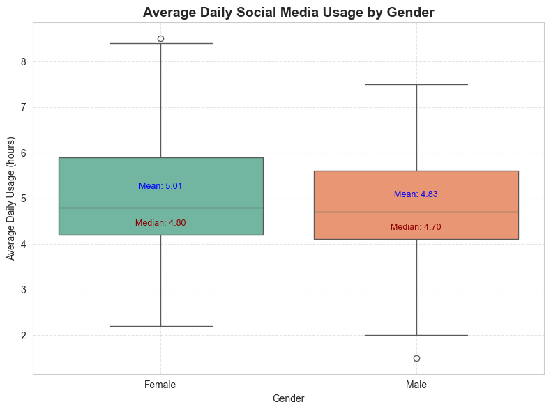
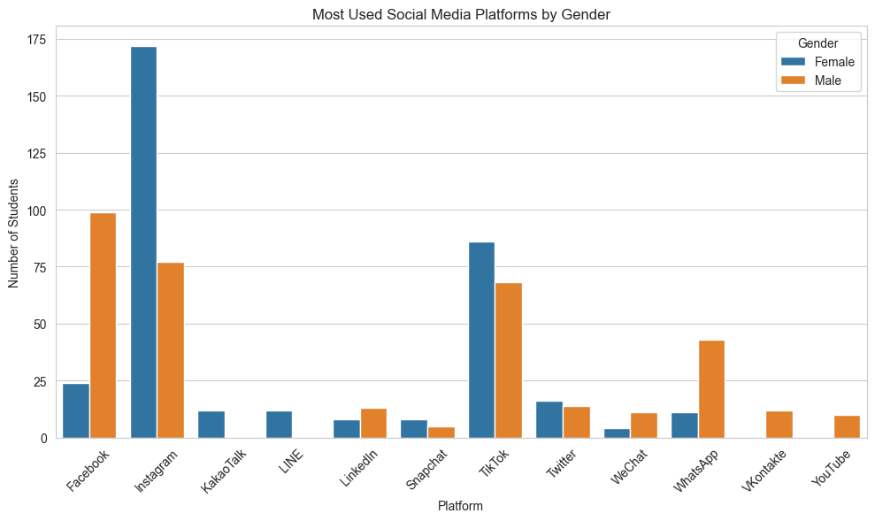
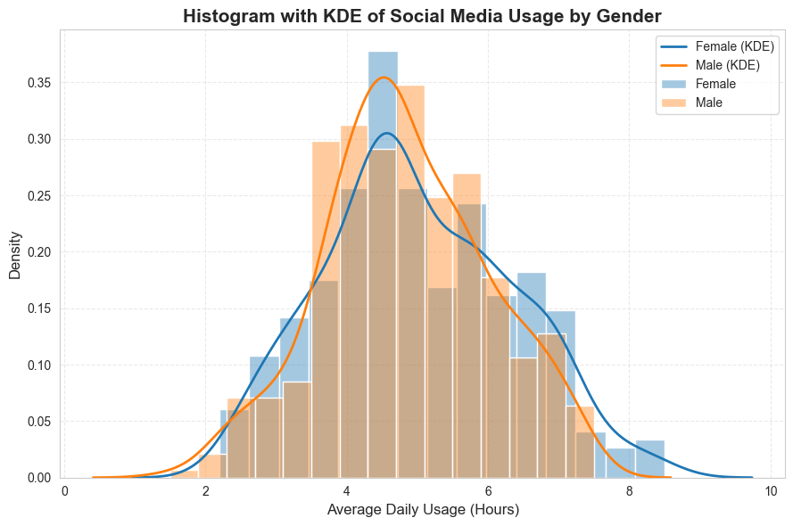

# Students Social Media Addiction Analysis

## Project Overview
This project, developed as part of the **"Programming Starter (PRS) – SoSe 2025"** course, aims to analyze a dataset on students' social media usage and potential addiction. Using **Python** with libraries like **Pandas** and **Matplotlib**, the analysis explores how demographic factors, particularly gender, influence usage patterns.  
The goal is to identify trends that can help inform digital well-being strategies and educational programs.

The dataset, titled **"Students' Social Media Addiction"**, was sourced from Kaggle and contains self-reported data from students across various countries.

---

## Research Question
**Do male and female students use different social media platforms and spend different amounts of time on them?**

---

## Methodology
To answer the research question, the following steps were taken:

1. **Data Cleaning and Filtering**  
   - Ensured valid entries for gender, platform usage, and daily usage hours.

2. **Exploratory Data Analysis (EDA)**  
   - Used boxplots, bar charts, and histograms with Kernel Density Estimation (KDE) to visualize and understand usage patterns.

3. **Statistical Analysis**  
   - Performed an independent two-sample **t-test** to statistically assess whether the difference in average daily social media usage between male and female students is significant.

---

## Key Findings
- **Daily Usage**  
  - Boxplot comparison showed that female students have a slightly higher median daily social media usage than male students, with more extreme outliers.  
  - The t-test revealed that this difference is **not statistically significant** (*p > 0.05*).

- **Platform Preferences**  
  - Instagram is the most preferred platform for both genders, with a greater proportion of female users.  
  - Male students show a stronger preference for Facebook and WhatsApp.

- **Usage Distribution**  
  - Male students’ usage is tightly centered around **4–5 hours/day**.  
  - Female students’ usage is more broadly spread, with more users spending **6+ hours/day** on social media.

---

## Preview
Here are some example visualizations from the analysis:

| Gender-based Daily Usage (Boxplot) | Platform Preference by Gender (Bar Chart) |
|-----------------------------------|---------------------------------------------|
|  |  |

**Usage Distribution with KDE:**


---

## Conclusion
The analysis identified meaningful correlations between social media usage patterns and demographic variables:
- Average daily usage between genders was **not statistically significant**.
- Behavioral differences exist in **platform preference** and **usage distribution**.

These insights can help in developing **targeted support strategies** and promoting **healthier digital habits** among students.

---

## Getting Started
### Requirements
- Python 3.x
- `pandas`
- `matplotlib`
- `seaborn` (for KDE plots)

### How to Run
1. Clone the repository or download the project files.
2. Install required libraries:
   ```bash
   pip install pandas matplotlib seaborn
